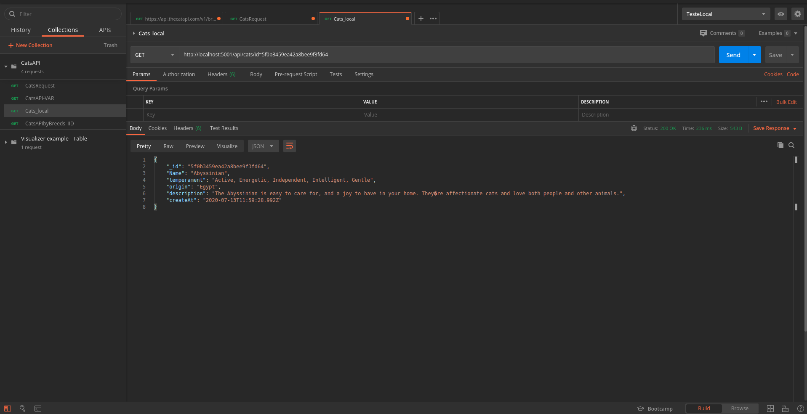

<p>
  
  <a href="/" target="_blank">
    
  </a>
  <a href="/LICENSE" target="_blank">
    
  </a>
  <a href="https://twitter.com/vitikovan" target="_blank">
    
  </a>
</p>

# Projeto API The Cats  :cat: 

É um projeto que captura dados de uma API chamada de [The Cats API](https://thecatapi.com/)

## :checkered_flag:Features
- Para cada uma das raças de gatos disponíveis, armazenar as informações de
origem, temperamento e descrição em uma base de dados. (disponivel na prox.release):heavy_multiplication_x:
- API disponibiliza o seu consumo de toda base de dados (Mongo) :heavy_check_mark:
- API disponibiliza o seu consumo por raça na base de dados. :heavy_check_mark:
- API disponibiliza o seu consumo por Temperamento na base de dados. :heavy_check_mark:
- API disponibiliza o seu consumo por Origem na base de dados. :heavy_check_mark:


## :cloud: Technologies

This project was developed at the [RocketSeat GoStack Bootcamp](https://rocketseat.com.br/bootcamp) with the following technologies:


-  [Axios](https://github.com/axios/axios), Para fazer o consumo na URL https://thecatapi.com/ 
-  [Express](https://github.com/expressjs/express) usado para criar as rotas dentro do node.
-  [Body-parser](https://github.com/expressjs/body-parser) Faz parte do Express
-  [Mongoose](https://github.com/Automattic/mongoose) usado para fazer a conexão com base de dados Mongo.
-  [Prom-client](https://github.com/siimon/prom-client) Para fazer a captura das metricas para monitoramento.

-  [VS Code][vc] with [EditorConfig][vceditconfig] and [ESLint][vceslint]


## :information_source: How To Use

Para clonar e executar este aplicativo, você precisará de [Git](https://git-scm.com),e do [Docker Swarm](https://docs.docker.com/compose/install/) instalado na sua maquina. Na sua linha de comando execute:

```bash
# Clonar este repositório
$ git clone https://github.com/augustovan/apiCatsProject

# Entre no repositório
$ cd apiCatsProject/cast_api_data

# E Executar o Docker compose
$ docker-compose up -d prometheus
$ docker-compose up -d grafana 
$ docker-compose up -d grafana-dashboards
$ sudo docker-compose up -d --build nodejs-application-cats

# Inicie o node e começe a consumir a API
$ docker exec nodejs-application-cats node index.js
```
### :electric_plug: Metodo para consulmo da API 


| URL                                      | Função                                           |
| -----------------------------------------|--------------------------------------------------|
| http://localhost:5001/api/cats           | Traz todos os gatos do Banco de dados            |
| http://localhost:5001/api/cats/b=[dados] | Traz os gatos por raça do Banco de dados         |
| http://localhost:5001/api/cats/o=[dados] | Traz os gatos por Origem do Banco de dados       |
| http://localhost:5001/api/cats/t=[dados] | Traz os gatos por Temperamento do Banco de dados |


### :rocket: Postman

- Tela de consulmo da API trazendo todos os dados do site APICats.


     
- Tela de consulmo da API trazendo todos os dados do site APICats.


- Tela de consulmo da API_Local trazendo os dados por Origem.


- Tela de consulmo da API_Localo os dados por Raça.


- Tela de consulmo da API_Local trazendo os dados por ID.



- Tela de consulmo da API_Local trazendo os dados por Temperamento.


## :fire: Monitormaneto da API (via Prometheus + Grafana)

- Tela monitoramento Grafana.


- Tela monitoramento Promethus.


## 📝 License

Copyright © 2020 [Victor Nascimento](https://github.com/augustovan).<br />
This project is [MIT](/LICENSE) licensed.

