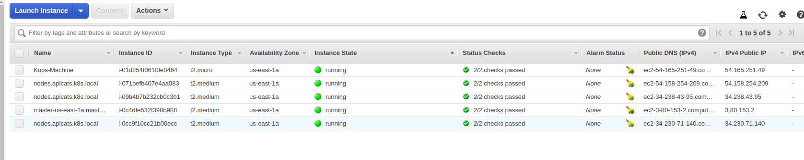
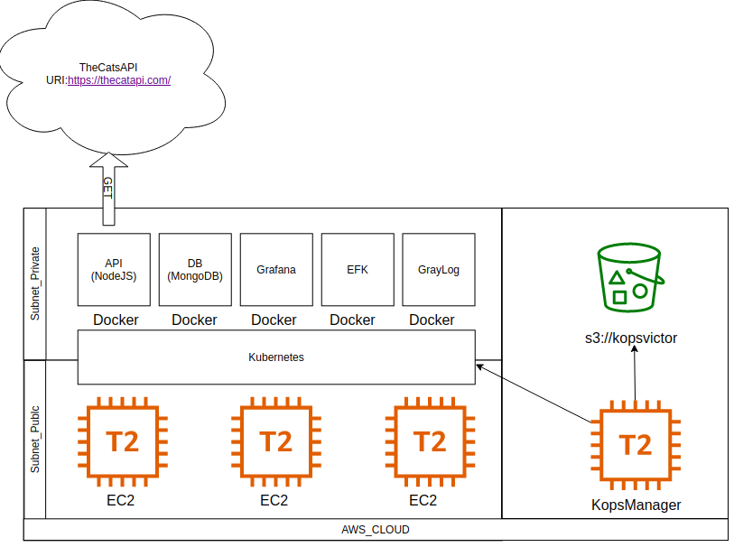
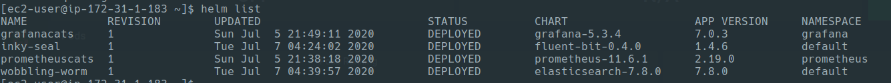
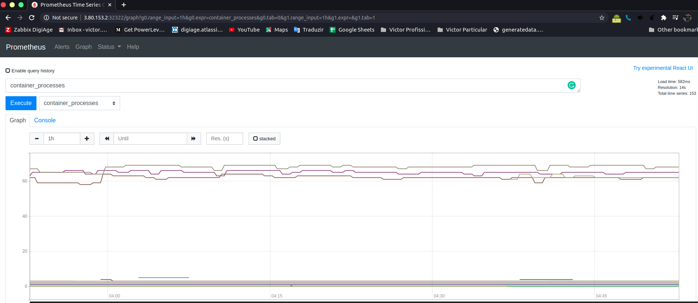
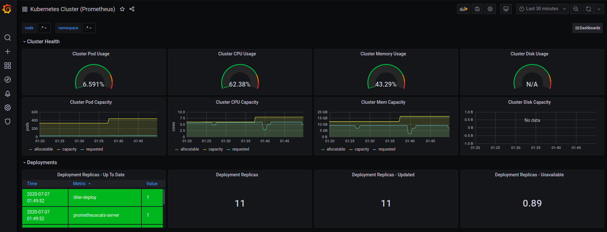
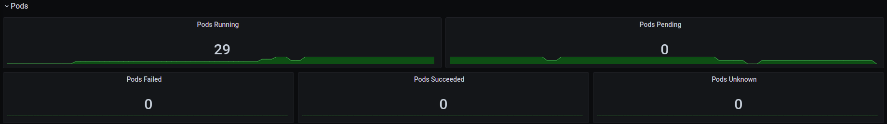
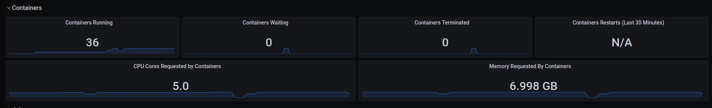

<p>
  
  <a href="/" target="_blank">
    
  </a>
  <a href="/LICENSE" target="_blank">
    
  </a>
  <a href="https://twitter.com/vitikovan" target="_blank">
    
  </a>
</p>

# Projeto API The Cats  :cat: 

Para criar uma Stack de MOnitoramento para qualquer API usando Kubernetes e Kops


## :rocket: Tecnologias Utilizadas

## Stack

| Component                 | Project / Technology                  |
| --------------------------|---------------------------------------|
| Automation Tool           | [Kops](https://kops.sigs.k8s.io/)     |
| Container runtime         | [Docker](https://www.docker.com)      |
| Container orchestration   | [Kubernetes](https://kubernetes.io)   |
| Package Manager           | [Helm](https://helm.sh/)              |
| Registry                  | [DockerHub](https://hub.docker.com/)  |
| Monitoring                | [Prometheus](https://prometheus.io/)  |
| Observability             | [EFK](https://www.elastic.co)         |

## Registry 
Aqui está o endereço de nosso registry no DockerHub. Lá voce vai encontrar os containers necessario para subir essa stack

[Docker-Hub](https://hub.docker.com/u/augustovan)  :whale: 

## Kops(AWS)
No nosso lab foi utiizado o Kops (Kubernete Operations), na cloud da AWS para o provisonamento das maquiasn, de inicio startamos 1 mastes (t2.medium) de 2 nodes (t2.medium).

### Instalando e Configurando o Kops

AWS Credentials (Security Key / Access key) 
"aws configure"
 
 ## Instalando o Kops Linux

From Github:

```bash
curl -Lo kops https://github.com/kubernetes/kops/releases/download/$(curl -s https://api.github.com/repos/kubernetes/kops/releases/latest | grep tag_name | cut -d '"' -f 4)/kops-linux-amd64
chmod +x ./kops
sudo mv ./kops /usr/local/bin/
```
## kops create cluster

1) Criar um S3 bucket para salvar as configs do cluster
  ```bash
  aws s3api create-bucket --bucket kubernetes-aws-io
  ```

2) Ativar o versionamento do Bucket caso haja necessidade de voltar para versão anterior 

  ```bash
  aws s3api put-bucket-versioning --bucket kubernetes-aws-io --versioning-configuration Status=Enabled
  ```
   
3) criar variavel **KOPS_STATE_STORE**

  ```bash
  export KOPS_STATE_STORE=s3://kubernetes-aws-io
  ```

4) Depois vamos passar os parametros para criar o cluster (no campo zones voce pode setar mais de uma availability zones ) :+1:

```bash
  kops create cluster \
--name catsapi.kubernetes-aws.io \
--zones us-east-1 \
--state s3://kubernetes-aws-io \
--master-size t2.medium --node-size t2.medium
--master-count 1 --node-count 3
--yes
  ```
5) E por fim voce aplica as configs  :sunglasses:
   
```bash
kops upgrade cluster \
--name catsapi.kubernetes-aws.io \
--state s3://kubernetes-aws-io \
--yes
  ```
... agora é só aguardar alguns instantes e *VOILÀ*  :ok_hand:



## kubernetes 
Utilizamos o kubernetes como nosso gerenciador de containers.



  ### Arquiterura Kubernetes 

* Namsespaces (Prometheus, Grafana, EFK, APP)
 ```bash
  kubectl create ns prometheus
  kubectl create ns grafana
  kubectl create ns EFK
  kubectl create ns APP
  ```
  Para saber se formar criados com sucesso executado o comando
    ```bash
  kubectl get ns
    ```
    
* PersistentVolume ( EBS - GP2(ext4)), basta acessa pasta *monitoring/storage* e executar o comando 
  ```bash
  kubectl apply -f pv-volume.yaml
  ```

  e verificar se foi criado com o comando 
   ```bash
  kubectl get pv
  ```

*  Storageclasse, basta acessa pasta *monitoring/storage* e executar o comando  ( cats-stc )

   ```bash
   kubectl apply -f pv-volume-storageclass.yaml
   ```

## Helm Install
Para cada aplicação da Stack de monitoração seria necessario criar 5 arquivos (deployment, service, configmap, pvc e um ingress) para cada solução. Isso demandaria muito tempo. Por este motivo escolhi utilizar a solução Helm aonde eu faço a instalação e o gerenciamento das aplicações de forma mais simplificada  
 
   ```bash
   helm inspect stable/aplicação > aplicação.values
   
   helm install stable/aplicação --name nomeaplicação --values aplicação.values --namespace nomeDoNamespace
   ```
- Para listar os serviços instalado basta utilizar o comando *helm list*




## Deploy Stack Monitoring
Uma forma de centralizar todos os Dashs e um unico ponto escolhi a solução grafana desta forma foi possivel criar os dash de monitoramento dos ambiente do Prometheus (coleta da saude do cluster) e para fazer a coleta dos logs tanto dos clustes como das aplicações foi escolhido a pilha EFK (Elasticsearch, fluentd, Kibana). Vale apena pontuar que mesmo a Kibanada está sendo usado para criar as queries usando KQL e aplicamos como data source no Grafana. 

### Provisionamento Prometheus
Para provisionar a aplicação Prometheus basta utilizar o comando 

   ```bash
  helm install stable/prometheus --name prometheus-cats --values prometheus.values --namespace prometheus
  ```

#### graficos Prometheus



### Provisionamento Grafana 
Para provisionar a aplicação Prometheus basta utilizar o comando 
   
   ```bash
  helm install stable/grafana --name grafana-cats --values grafana.values --namespace grafana
  ```

#### graficos Grafana



 

    

### Provisionamento EFK
Para provisionar a stak EFK voce deve executando esses 3 comando (diferente do ELK que usa Logstash para coleta dos logs, aqui vamos utilizar o fluentd para coletar logs do Kubernetes)

   ```bash
  helm install elastic/elasticsearch --name elasticsearch --values elasticsearch.values --namespace efk
  helm install fluent/fluent-bit  --name fluentdcats --values fluent.values --namespace efk
  helm install elastic/kibana --name kibanacats --values kibana.values --namespace efk

  ```

# On Primese :computer:

## Ansible
Para fazer o provisionamento do ambiente em um ambiente on primese vamos utilizar o 
Ansile , no arquivo *Ansible/PLaybook.yaml* comentar das linhas 1 a 17 (caso queira provisionar maquinas na AWS usando Ansible). depois disso se faz necessario alterar o arquivo HOSTS e colocar os ips das maquinas que vão fomrar o cluster K8s 

## PersistenVolum em ambiente On primessis
Para criar o Persistemvolum voce pode criar o PV local ou usar o atributo NFS o mais reomendado por conta de latencia.
Após o prosionamento do cluster k8s será necessario fazer a instalação do Helm e seguir os passos acima Topico do Helm 


## 📝 License

Copyright © 2020 [Victor Nascimento](https://github.com/augustovan).<br />
This project is [MIT](/LICENSE) licensed.

